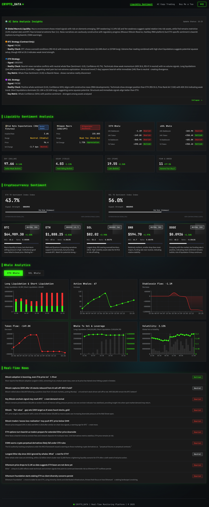
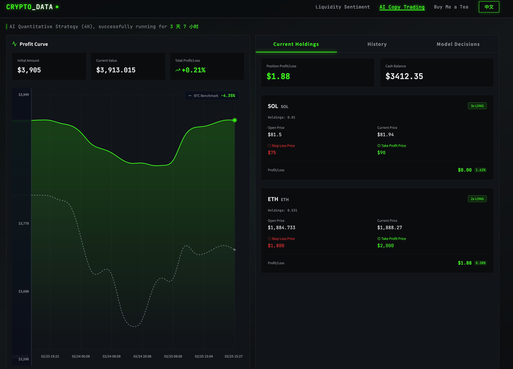
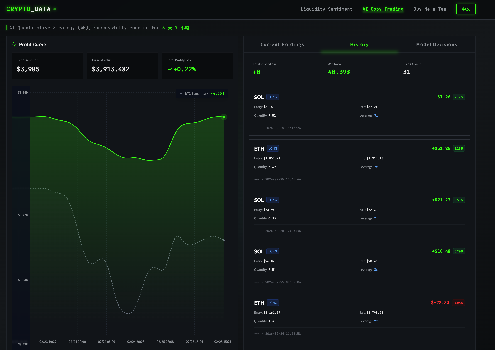
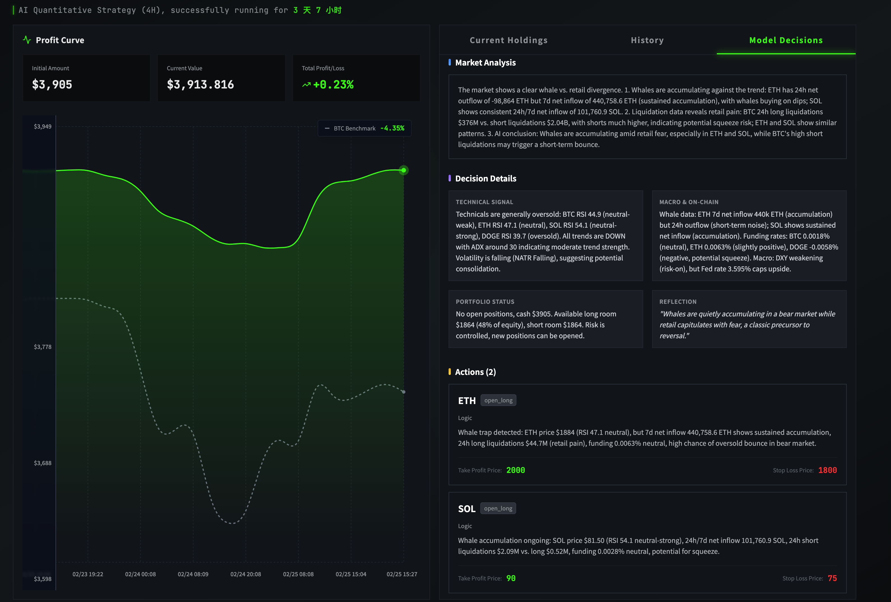
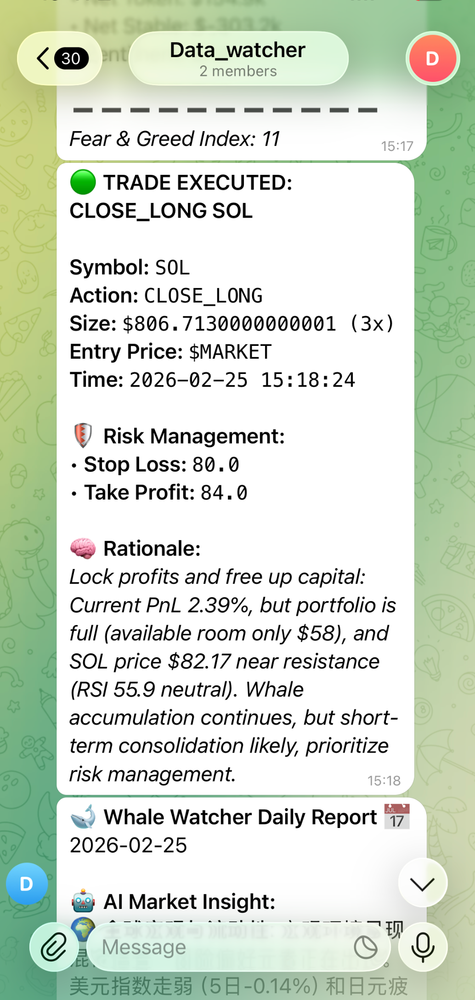
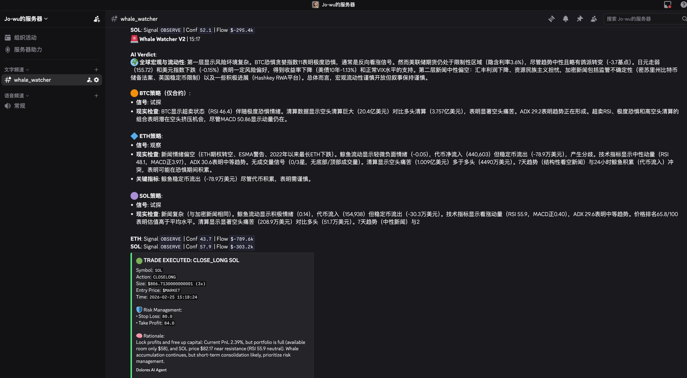
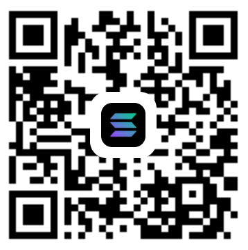

<p align="center">
  
</p>

<p align="center">
  <a href="README_CN.md"></a>
  <a href="README.md"></a>
  <a href="README_JP.md"></a>
</p>

# 🐋 AI 鲸鱼监控与量化交易终端 (Dolores V2.0)

**这是一个利用<font color="red">免费链上资源、完全自主</font>的加密货币，4小时为基准分析维度的<font color="red">超低成本 AI 趋势量化交易</font>与<font color="red">链上数据监控</font>终端。能够在无人干预的情况下进行 24/7 的市场研判并通过okx实盘/paper trade 交易。**

📺 **最佳实践在线演示 (Live Demo):** [https://whale.sparkvalues.com/](https://whale.sparkvalues.com/)

# ⭐ 功能列表

> ⚠️ **免责声明**：本项目仅供学习、研讨与研究使用，不构成任何投资建议。

| 模块 | 已实现 |
| :--- | :--- |
| **鲸鱼异常监控 (Whale Hub)** | ✅ 实时监控 ETH/SOL 链上大额异动<br>✅ 多维度数据整合 (DefiLlama, Moralis, Etherscan)<br>✅ 24h/7d 稳定币与代币净流出分析<br>✅ 精准识别鲸鱼“吸筹”与“出货”背离信号<br>✅ 全球市值占比与流动性变化动态追踪 |
| **AI 量化交易系统 (Dolores)** | ✅ 基于 DeepSeek-V3 大脑的 4H 周期自动决策<br>✅ **Qlib 相对强弱模型**: 多币种打分与 Rank 权重推荐<br>✅ **叙事校验 (Narrative vs Reality)**: 识别消息驱动 vs 已定价陷阱<br>✅ **战场纪律 (4D Rules)**: 防爆仓踩踏与费率陷阱强制防守<br>✅ 影子测试 (Shadow Mode) 与 实盘切换 / OCO 止盈止损 |
| **宏观、流动性与链上** | ✅ **Z-Score 异常探测**: 成交量与资金费率的统计学极端偏离监控<br>✅ **巨鲸动态 (Whale Flow)**: $ETH/$SOL 7天与24小时净流向深度集成<br>✅ **影线感知 (Wick Ratio)**: 自动识别 K 线长下影/长上影等反转信号<br>✅ 美联储利率预期、日元套利、DXY/VIX/恐慌贪婪多维共振 |
| **系统集成与自动化** | ✅ 云原生 MongoDB 云端状态毫秒级同步 & GitHub 实时数据持久层<br>✅ Telegram & Discord 多端实时实盘开单战报<br>✅ 前后端彻底解耦架构 (React + Flask)<br>✅ 全自动 Run Loop 时序调度，对齐 K 线收盘 |

---

**本系统包含一个 Python 后台调度引擎与一个多维数据可视化的 React/Next.js Web3 前端仪表盘。**

**由AI模型决策的开单收益曲线与交易理由**



**4小时维度的telegram群发与开单通知**

**4小时维度的discord群发与开单通知**



---

# 📅 近期更新日志 (Update History)

| 日期 | 核心更新内容 |
| :--- | :--- |
| **2026-02-26** | **V2.0 大版本升级**: 接入 Qlib 模型打分、Z-Score 异常探测和强化风控体系。前端面板新增定量分析与安全态势模块，支持即时数据的 Live Qlib Bridge，并全面落成多语言 (UI及文档)。 |
| **2026-02-25** | **多语言本地化**: 前端（新闻聚合、AI交易分析聚合）全面支持双语切换。更新赞助通道并支持 Solana Blink 一键支付功能。 |
| **2026-02-24** | **系统风控约束**: 为 AI 大脑注入动态风险控制约束提示词，避免实盘 API 因极端参数驳回开单。增强数据库组合净值 (NAV) 历史记录的自愈恢复能力。 |
| **2026-02-23** | **AI 代理能力进化**: 将大模型代理记忆与实盘交易历史解耦，防止产生仓位幻觉错乱。输入源集成 7 天为周期的巨鲸资金流向趋势，稳固净值计算 baseline 基准。 |

---

# 🌟 核心突破与功能 (Key Features)

### 1. 全自动 AI 基金经理 (Agentic AI Trader)
不再是简单的死板网格或均线策略，系统的核心大脑（DeepSeek LLM）综合了当前市场的六维多模态情报（资金、图形、宏观、杠杆、仓位），并在执行交易后自动附带 **开单逻辑 (Rationale)** 与 **风控计划 (Exit Plan)**。
*   **支持 OKX V5 统一账户**: 全自动处理多空双向 (Long/Short) 合约交易、动态杠杆计算、实时未实现盈亏 (uPnL) 监控。
*   **自带 OCO 止盈止损**: 系统每次开仓都会向 OKX 发送 Conditional Trigger 订单，严格锁定最大回撤。
*   **叙事校验与剧本系统**: 强制 AI 在决策前评估“消息是否已被计价”并从“趋势跟踪/均值回归/鲸鱼抢跑”三大剧本中选一。
*   <font color="red">**历史自我反思**</font>: AI 每次交易前会拉取过去的历史判断与盈亏表现，动态调整当下的风险偏好。

### 2. 六维全景感知 (Multi-Dimensional Perception)
大模型每 4 小时进行一次深度思考，输入的数据包含：
*   **🐋 链上资金流**: 追踪巨鲸的买卖金额、稳定币净流入/流出 (基于 Moralis & Solana Helius API)。
*   **📊 技术面特征工程**: 不向 AI 抛原始 K 线，而是通过内部清洗提取 RSI, ADX (趋势极值), MACD 以及 **星级评分 (Star Ratings)**（基于价格排位、成交量异常和 RSI 极值的 0~3 星级评估法，专门寻找顶部反转与底部吸筹）。
*   **💸 衍生品清算**: 监控多空爆仓强平数据，寻找空头轧空 (Short Squeeze) 机会。
*   **🌍 宏观经济 (Macro)**: 无缝集成美联储降息预期 (Fed Futures)、美元指数 (DXY)、美债收益率 (US10Y)、VIX 恐慌指数、日元套利影响 (Japan Rates) 以及全球恐慌贪婪指数。
*   **📰 新闻情绪面**: 实时抓取圈内头条新闻并分析整体文本情绪分。

### 3. 高级风控与交易纪律 (Advanced Risk Control)
为了应对加密货币市场的高波动性，Dolores 建立了一套严苛的战友纪律（Tactical Discipline）：
*   **Anti-Liquidity Rush (防踩踏机制)**: 当市场处于单边爆仓洗盘（爆仓多空比 > 3x）或垂直价格波动时，AI 会将这些爆仓视为“燃料”而非反转信号，禁止立即对冲，直至波动率衰减。
*   **右侧入场逻辑 (Wick Confirmation)**: 即使鲸鱼信号发出“左侧预警”，AI 也会等待 K 线收出长影线（Wick Ratio）等反转形态，配合价格突破关键位后再行入场。
*   **衍生品陷阱校验**: 深度监控资金费率 (Funding Rate) 与持仓量 (OI)。在费率极端（>0.03% 或 <-0.01%）的情况下，AI 会识别为“拥挤交易”，强制停止该向开单以避开潜在的 Squeeze。
*   **核心仓位平衡算法 (Position Management)**: 
    - **Dynamic Exposure (动态敞口上限)**: 根据 BTC SMA200 确定的市场格局 (Regime) 实时分配多空总额度（如：牛市多头上限 98%，熊市多头强制压缩至 40%）。
    - **Volatility-Adjusted Leverage (波动率调节杠杆)**: 无缝对接 Fear & Greed Index。在极端行情（指数 < 20 或 > 80）下，系统底层会自动触发「防御模式」，将全账户最高杠杆强制降至 2x，防止情绪化踩踏导致的插针爆仓。
    - **Hard Slot Constraint (三席位限制)**: 严格限制全账户最多同时持有 3 个头寸，通过物理限仓实现天然的风险分散，避免因 AI 策略过热导致的资金过度杠杆化。

### 4. 数据层与部署架构彻底解耦 (V2.0 更新)
*   **云原生 MongoDB 存储**: 彻底告别了依靠 GitHub commit 同步数据的痛点。现在系统的后台执行记录、组合净值 (Portfolio State) 与实时市场研判全都毫秒级保存至 MongoDB。
*   **Serverless 前端**: 前端基于 React/TypeScript 构建，部署于 Vercel。提供赛博朋克风的动态布局，具备多语言切换 (i18n)、实时资金收益曲线绘制、大模型多维分析报告展示等功能。
*   **自动化容器调度**: 后端通过 Railway 等云平台进行调度，严格匹配 4 小时 K 线收盘时间（0点, 4点, 8点...）执行感知-分析-交易的闭环运转。

### 5. 实时战报多渠道预警
*   集成 Telegram (HTML 渲染) 和 Discord 通知。只要模型触发了下单、平仓或检测到重大异动，实时代币方向、盈亏概览和 AI 判断的“核心理由”都会推送到手机。

---

# 🛠️ 技术栈与系统架构 (Tech Stack)

### **Backend (Python 3.10+)**
*   **`ai_trader.py`**: 基金经理大脑。构建复杂的 Prompt，通过 DeepSeek API 思考并调用执行器下单。
*   **`crypto_brain.py`**: 情报总局。负责拼接所有外部 API (Moralis/Macro/News) 的数据。
*   **`technical_analysis.py`**: Quant 引擎。负责计算 RSI、ADX、星级打分以及流动性指标。
*   **`okx_executor.py`**: 执行引擎。封装了高健壮性的 OKX V5 REST API 签名、下单和鉴权。
*   **`db_client.py`**: 数据持久化引擎。连接 MongoDB 处理状态。
*   **`run_loop.py`**: 时序调度器。对齐 K 线收盘时间启动工作流。

### **Frontend (React / Vite / Tailwind)**
*   组件化仪表盘：宏观流动性分析 (`detailed-stats`, `market-stats`)、巨鲸异动分析 (`whale-analytics`)、AI 跟单模拟 (`ai-copy-trading` 包含真实 PnL 曲线可视化)。

---

# 🚀 快速开始与部署指南 (Quick Start)

为了确保新手也能顺利运行，请按以下步骤操作。

### 0. 准备工作 (Prerequisites)
1.  **Python 3.10+**: [下载地址](https://www.python.org/downloads/)
2.  **Node.js 18+**: [下载地址](https://nodejs.org/)
3.  **MongoDB 环境**: 推荐使用免费的 [MongoDB Atlas](https://www.mongodb.com/products/platform/atlas-database)。

---

### 1. 配置环境变量 (`.env`)
在 `backend` 目录下创建一个名为 `.env` 的文件，并填入以下内容：

| 变量名 | 获取来源 (Source) | 说明 |
| :--- | :--- | :--- |
| `OKX_API_KEY` | [OKX API 页面](https://www.okx.com/account/my-api) | 请确保开启「交易」权限 |
| `DEEPSEEK_API_KEY` | [DeepSeek 开放平台](https://platform.deepseek.com/) | 建议充值少量额度 |
| `MONGODB_URI` | [MongoDB Atlas](https://www.mongodb.com/products/platform/atlas-database) | 获取格式为 `mongodb+srv://...` 的连接串 |
| `MORALIS_API_KEYS` | [Moralis Admin](https://admin.moralis.io/) | 用于链上大额资金监控 |
| `SOLANA_API_KEYS` | [Helius](https://www.helius.dev/) | 用于 Solana 链上数据抓取 |

---

### 2. 启动后端引擎 (Backend)
```bash
cd backend
# 1. 创建虚拟环境 (推荐)
python3 -m venv venv
source venv/bin/activate  # Windows 用户使用 venv\Scripts\activate

# 2. 安装依赖 (此步可能需要 2-3 分钟)
pip install -r requirements.txt

# 3. 运行主程序
python run_loop.py
```

---

### 3. 启动前端仪表盘 (Frontend)
```bash
cd frontend
# 1. 安装依赖
npm install

# 2. 启动开发服务器
npm run dev
# 访问 http://localhost:3000 即可看到仪表盘
```

---

### 4. 一键部署 (Railway & Vercel)
*   **后端 (Railway)**: 关联此 GitHub 仓库至 Railway，会自动识别脚本运行。记得在 Railway 控制面板填入 `.env` 中的变量。
*   **前端 (Vercel)**: 关联 frontend 目录至 Vercel，它会自动识别 Vite 配置并发布。

---


# ☕️ 请我喝茶 (Buy Me a Coffee)

感谢star⭐和follow！不时更新
作者的联系方式在主页里，有问题可以随时联系我
可以关注下作者的其他项目，欢迎 PR 和 issue
感谢赞助！如果此项目对您有帮助，请作者喝一杯奶茶~~ （开心一整天😊😊）
thank you~~~

| 支付宝 (Alipay) | Solana (SOL/USDC) |
| :---: | :---: |
|  |  |
| `newjowu@gmail.com` | `2oAoK4D4hq5nGE2JVSknuWY4YDxaF5u7uB1arf1s2TNY` |

### 🚀 Solana Blink (一键支付)
如果你正在使用支持 Blink 的钱包（如 Phantom/Backpack），可以点击下方链接直接支付：
[Solana 快速捐赠](https://www.dial.to/?action=solana-action:https://action.solscan.io/api/donate?receiver=2oAoK4D4hq5nGE2JVSknuWY4YDxaF5u7uB1arf1s2TNY)

---
*感谢你的支持！所有捐赠将用于支付服务器与 DeepSeek API 费用。*

# 🛡️ 风险提示 (Disclaimer)
本项目作为一个完整的量化与链上监控体系，调用了真实的深度交易接口。尽管系统中内置了完备的异常处理、安全防线和硬止损逻辑，但加密货币市场的极端行情依然可能导致严重的资产折损。作者提供本架构仅作为学习与系统演示之目的，不对在 **REAL 模式实盘运行代码** 造成的资金亏损负责。建议先在纸面 (Paper Trading) 或模拟盘测试策略！
