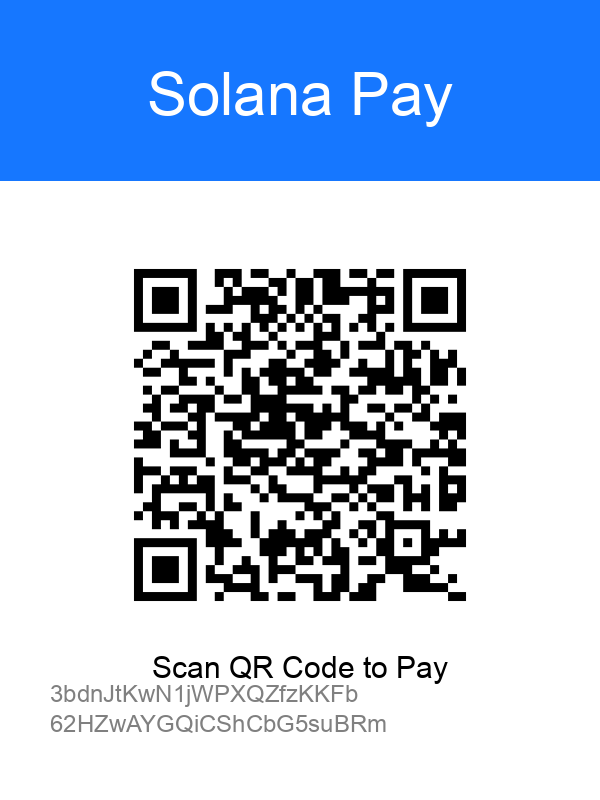

# 🐋 Whale Monitor AI (ホエール・モニター AI)


<div align="center">

[🇺🇸 English](README.md) | [🇨🇳 中文](README_CN.md) | [🇯🇵 日本語](README_JP.md)

</div>

> **DeepSeek R1、オンチェーンデータ、リアルタイム市場分析を搭載した自律型暗号資産クオンツエージェント。**

---

## 📖 はじめに

**Whale Monitor AI** は単なる取引ボットではありません。あなたのサーバーに常駐する高度な市場アナリストです。以下の3層のデータを組み合わせて、確信度の高い取引判断を下します：

1.  **マクロ層**: FRB金利、流動性トレンド、世界的なニュースセンチメントを監視します。
2.  **ホエール層**: EthereumおよびSolanaチェーン上のリアルタイムの大口送金（ホエールアラート）を追跡します。
3.  **市場層**: 板情報（オーダーブック）の厚み、清算ヒートマップ、プライスアクションを分析します。

4時間ごと（設定可能）に、AIはこの膨大なデータを消化し、現在の市場レジーム（強気/弱気/レンジ）について「思考」し、機関投資家レベルのリスク管理基準で **OKX** 上で取引を実行します。

---

## ✨ 主な機能

*   **🧠 大規模言語モデルによる意思決定**: `DeepSeek-V3/R1` を使用して人間のような推論を行い、市場の罠（例：「ショートスクイーズ」や「クジラの売り抜け」）を検知します。
*   **🛡️ 機関投資家レベルのリスク管理**:
    *   **分離マージン (Isolated Margin)**: 単一ポジションの損失から口座残高を保護します。
    *   **ハード TP/SL (Hard TP/SL)**: すべての取引に自動的にアルゴリズム注文（損切り・利食い）を付与します。ボットがオフラインになっても資金は安全です。
    *   **スマートサイジング**: ボラティリティと確信度に基づいてポジションサイズを動的に調整します。
*   **🔗 マルチチェーン監視**: ETHおよびSOLのホエール追跡をサポートしています。
*   **📱 リアルタイム通知**: 詳細な分析レポートを **Telegram** と **Discord** に送信します。

---

## 🌟 ベストプラクティス & ライブデモ (Live Demo)

ボットの実際の動作をご覧ください！このコードを実行しているリアルタイムダッシュボードとTelegramシグナルグループを公開しています。

### 📊 ライブダッシュボード (Web Dashboard)
**[👉 whale.sparkvalues.com](https://whale.sparkvalues.com)**
*AI分析結果と資産追跡をリアルタイムで可視化。*

### 📢 Telegram シグナルグループ
**[👉 グループに参加](https://t.me/+u-P4xaw0ZptlOGZl)**
*自動取引シグナルとホエールアラートを24時間365日受信。*

<div align="center">
  
</div>

### 💬 Discord コミュニティ
**[👉 Discordに参加](https://discord.gg/WBQNCHst)**
*トレーディング戦略の議論や機能リクエストはこちら。*

---

## 🚀 クイックスタート

### 前提条件
*   [Docker](https://www.docker.com/) & Docker Compose
*   OKX アカウント (トレード権限のあるAPIキー)
*   DeepSeek API キー
*   Moralis / Etherscan API キー (オンチェーンデータ用)

### 1. クローンとセットアップ
```bash
git clone https://github.com/your-repo/whale-monitor-ai.git
cd whale-monitor-ai

# データディレクトリの作成
mkdir -p assets
# カスタマイズしたい場合は assets/ に banner.png と payment_code.jpg を配置してください
```

### 2. 環境変数の設定
テンプレートをコピーしてキーを入力します：
```bash
cp .env.example .env
nano .env
```
**重要な設定**:
*   `OKX_API_KEY`, `OKX_SECRET_KEY`, `OKX_PASSPHRASE`: 取引認証情報。
*   `TRADING_MODE`: リアルマネーは `REAL`、ペーパートレーディングは `DEMO` に設定します。最初は必ず DEMO でテストしてください！
*   `DEEPSEEK_API_KEY`: オペレーションの頭脳です。

### 3. Docker で実行
以下のコマンドだけで起動します：
```bash
docker-compose up -d --build
```
ボットがバックグラウンドで起動します。ログを確認するには：
```bash
docker-compose logs -f
```

---

## 🛠️ 設定詳細

| 変数名 | 説明 | デフォルト値 |
| :--- | :--- | :--- |
| `TRADING_MODE` | `REAL` または `DEMO`。必ず最初に DEMO でテストしてください！ | `DEMO` |
| `MAX_LEVERAGE` | AI が使用できる最大レバレッジ。 | `3` |
| `TIMEFRAME` | 実行間隔 (例: 4h, 1h)。コード `run_loop.py` で設定します。 | `4 hours` |

---

## ☕ 開発者を支援する (Coffee)

このボットが利益をもたらした場合は、開発の支援をご検討ください！

<div align="center">
  
  
  <p>Alipay (支付宝) | Solana (SOL)</p>
  <code>3bdnJtKwN1jWPXQZfzKKFb62HZwAYGQiCShCbG5suBRm</code>
</div>

---

## ⚠️ 免責事項
暗号資産取引には高いリスクが伴います。本ソフトウェアは「現状有姿」で提供され、いかなる種類の保証もありません。AI の決定は確率に基づいており、確実性を保証するものではありません。**ご自身のリスクで使用してください。**
